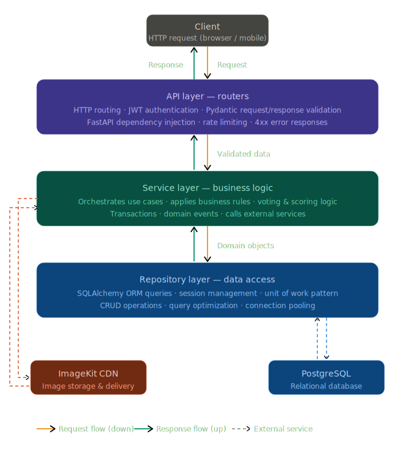
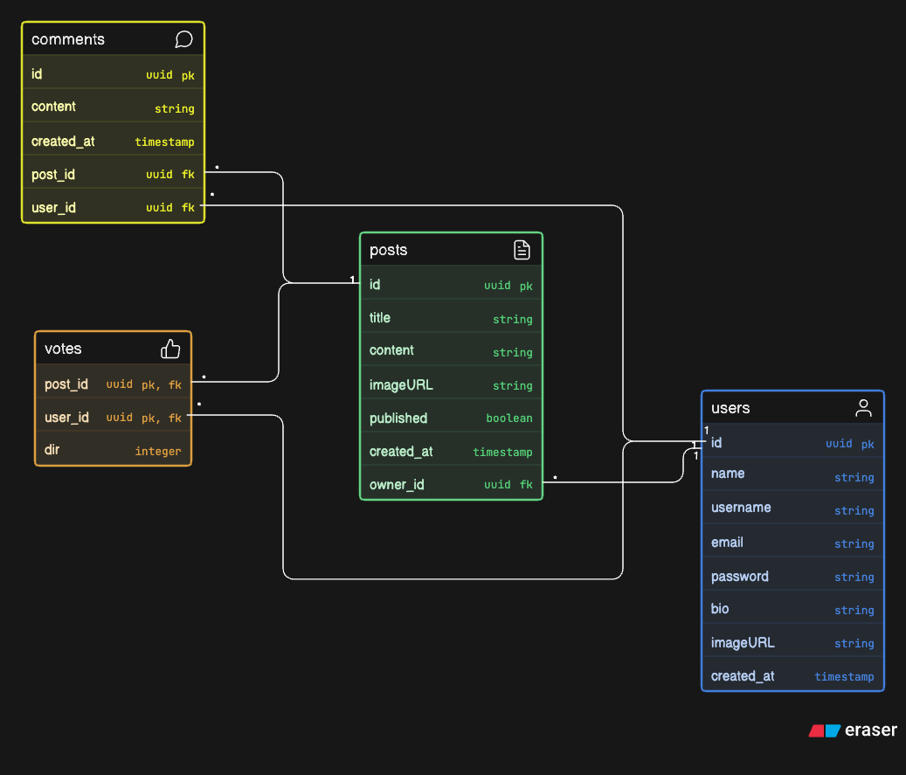

<div align="center">
  
  <h1>Hive (Hive Room)</h1>
  <p><strong>A Hyperlocal Social Media Application based on Proximity</strong></p>

  <p>
    
    
    
    
    
  </p>
</div>

---

## 📖 Project Overview

**Hive** (also known as Hive Room) is a location-based, hyperlocal social media platform designed to connect people within a specific geographic radius (e.g., 2–3 km). It is ideal for university campuses, local community events, and neighborhood discussions. 

By focusing on proximity and ephemeral interactions, Hive encourages meaningful, real-time engagement among users who are physically close to each other.

---

## ✨ Features

### 🟢 Current Features (MVP)
The current Minimum Viable Product focuses on the core asynchronous social loop:
* **User Authentication:** Secure JWT-based login and registration.
* **Profile Management:** Users can customize their profiles, including bios and avatars.
* **Post Creation & Management:** Users can create, update, delete, and view posts.
* **Rich Media:** Posts support both text and image uploads (handled via ImageKit).
* **Engagement System:** 
  * Users can comment on active discussions.
  * Upvote and downvote posts.
  * Real-time calculation of total vote count (Upvotes - Downvotes).
* **CI/CD Pipeline:** Fully automated deployments to a Hostinger VPS utilizing GitHub Actions and Docker.

### 🚀 Upcoming Features (Roadmap)
* **Location-Based Chatrooms (Core):** Ephemeral chatrooms tied to a specific geographic radius (e.g., disappearing after 2–3 hours).
* **Real-time Messaging:** WebSocket integration for instant, private 1-on-1 chatting.
* **Algorithmic Ranking:** A background processing engine (via Celery/Redis) to surface trending posts based on engagement velocity and proximity.
* **Push Notifications:** Alerting users of nearby activity or direct interactions.

---

## 🛠 Tech Stack

### Frontend
- **Framework:** React 19 + Vite
- **Styling:** Tailwind CSS v4 alongside a custom "Cozy Vintage" design system (`Playfair Display` + `DM Sans`).
- **Routing:** React Router v6
- **State Management:** React Context API (Auth Context)

### Backend
- **Framework:** FastAPI (Python)
- **Database ORM:** SQLAlchemy 2.0
- **Migrations:** Alembic
- **Authentication:** JWT (JSON Web Tokens) with `bcrypt` for password hashing
- **File Storage:** ImageKit Integration for optimized image delivery

### Infrastructure & Deployment
- **Database:** PostgreSQL 17
- **Containerization:** Docker & Docker Compose (Multi-stage builds)
- **CI/CD:** GitHub Actions (Automated testing, building, and SSH deployment)
- **Hosting:** Hostinger VPS (Ubuntu)

---

## 🏗 Architecture Overview

Hive uses a decoupled **Client-Server Architecture**.

### 🌟 Backend Design Pattern (Built for Scalability)
To ensure the backend remains maintainable, testable, and highly scalable as the application grows, Hive implements a strict **3-Layer Architecture** (Controller-Service-Repository pattern). This design cleanly separates concerns, demonstrating enterprise-level backend practices:



1. **API Layer (Routers/Controllers):**
   * **Role:** Handles incoming HTTP requests, authenticates tokens, validates payloads using Pydantic schemas, and returns appropriate HTTP responses.
   * **Scalability Benefit:** Keeps routing logic extremely lightweight and independent of business rules, making it easy to version APIs (e.g., v1 vs. v2) without duplicating logic.

2. **Service Layer (Business Logic):**
   * **Role:** The heart of the application. It orchestrates operations, applies complex business rules (e.g., checking if a user has already voted, managing feed ranking algorithms), and processes data.
   * **Scalability Benefit:** Centralizes business rules so they can be reused across different interfaces (e.g., REST API, WebSockets, background Celery workers). It also drastically simplifies unit testing by allowing easy mocking of data storage.

3. **Repository Layer (Data Access):**
   * **Role:** Completely encapsulates physical database interaction using SQLAlchemy. It is the only layer that actively executes SQL queries and manages ORM sessions.
   * **Scalability Benefit:** Decoupling data access means that if we need to introduce database sharding, switch ORMs, or add a Redis caching layer for read-heavy operations, we only modify the repositories. The Service and API layers remain completely untouched.

### Request Flow
1. **Client Request:** The React frontend makes RESTful HTTP requests to the FastAPI backend.
2. **Routing:** The API layer receives the request, delegates the workload to the appropriate Service class.
3. **Processing:** The Service layer executes business logic and requests necessary data by calling methods on the Repository layer.
4. **Data Retrieval:** The Repository interacts with PostgreSQL. Complex aggregations are handled efficiently via SQL `OUTER JOIN`s before returning mapped entities to the Service.
5. **Asset Management:** Uploaded images are securely proxied to **ImageKit**, caching the optimized CDN URL in the DB.
6. **Deployment:** Pushes to `main` trigger GitHub Actions to build Docker images, SSH into the VPS, apply Alembic migrations, and spin up new instances via Docker Compose.

---

## 🔌 API Documentation

The backend exposes a fully documented OpenAPI (Swagger) interface, accessible at `/api/v1/docs` when running locally.

### Key Endpoints:
| Method | Endpoint | Description | Auth Required |
|--------|----------|-------------|---------------|
| `POST` | `/api/v1/auth/login` | Authenticate and retrieve JWT payload | No |
| `POST` | `/api/v1/users/` | Register a new user | No |
| `GET`  | `/api/v1/users/{id}` | Get user profile (public or private depending on token) | Yes |
| `PUT`  | `/api/v1/users/{id}` | Update user profile details and avatar | Yes (Owner) |
| `DELETE`| `/api/v1/users/{id}` | Permanently delete user account | Yes (Owner) |
| `GET`  | `/api/v1/posts/` | Fetch paginated feed of posts (includes vote/comment count) | Yes |
| `POST` | `/api/v1/posts/` | Create a new post (supports `multipart/form-data` for images) | Yes |
| `PATCH`| `/api/v1/posts/{id}` | Update existing post details | Yes (Owner) |
| `DELETE`| `/api/v1/posts/{id}` | Delete a specific post | Yes (Owner) |
| `GET`  | `/api/v1/comments/{post_id}`| Fetch all comments for a specific post | Yes |
| `POST` | `/api/v1/comments/` | Append a comment to a specific post | Yes |
| `POST` | `/api/v1/vote/` | Upvote (`1`), Downvote (`-1`), or Remove Vote (`0`) on a post | Yes |

---

## 🗄 Database Schema Overview



The relational PostgreSQL database is designed around four core entities:

* **`users`**: Stores authentication credentials, profile metadata (name, bio), and ImageKit URLs.
* **`posts`**: Belongs to a User. Contains textual content, optional media URLs, and timestamps.
* **`comments`**: Belongs to a User and a Post. Stores user replies.
* **`votes`**: A composite association table linking Users and Posts. Prevents duplicate voting and tracks vote direction (1 or -1).

---

## 🔐 Authentication Flow

1. User registers or logs in by sending credentials to `/api/v1/auth/login`.
2. The server hashes/verifies the password using `bcrypt`.
3. If successful, the server signs a **JSON Web Token (JWT)** and returns it to the client.
4. The React frontend stores this token and attaches it as a `Bearer` token in the `Authorization` header of subsequent requests.
5. FastAPI dependency injection (`get_current_user`) intercepts protected routes to decode the JWT, verify expiration, and fetch the corresponding user from the DB.

---

## 🚀 Installation & Setup Instructions

### Prerequisites
* Docker and Docker Compose installed on your local machine.

### Local Development Setup

1. **Clone the repository:**
   ```bash
   git clone https://github.com/your-username/hive.git
   cd hive
   ```

2. **Environment Variables:**
   You do not need an `.env` file for local development if you are using Docker, as the `docker-compose.dev.yml` hardcodes local testing credentials. However, you will need ImageKit credentials if you plan to upload images.
   *(See `.env.example` in the root directory for required production keys).*

3. **Start the application:**
   ```bash
   docker compose -f docker-compose.dev.yml up --build
   ```

4. **Run Database Migrations:**
   Once the containers are running, you must run Alembic to generate the tables:
   ```bash
   docker compose -f docker-compose.dev.yml exec backend alembic upgrade head
   ```

5. **Access the application:**
   * **Frontend:** `http://localhost:5173` (or the port specified by Vite)
   * **Backend API:** `http://localhost:8000/api/v1`
   * **API Docs (Swagger):** `http://localhost:8000/docs`

---

## 📁 Project Structure

```text
hive/
├── hive-frontend/           # React 19 Frontend Application
│   ├── src/                 # Source code (Components, Pages, Contexts)
│   ├── package.json         # Node dependencies
│   └── vite.config.js       # Vite bundler configuration
│
├── hive-backend/            # FastAPI Application
│   ├── alembic/             # Database migration scripts
│   ├── app/                 # Application codebase
│   │   ├── api/             # Route handlers (Controllers)
│   │   ├── core/            # Configuration and security, exceptions
│   │   ├── db/              # SQLAlchemy session setup
│   │   ├── models/          # SQLAlchemy ORM models
│   │   └── schemas/         # Pydantic schemas (Validation)
│   ├── Dockerfile.dev       # Local development Dockerfile
│   ├── Dockerfile.prod      # Production multi-stage Dockerfile
│   └── requirements.txt     # Python dependencies
│
├── .github/workflows/       # CI/CD GitHub Actions pipelines
├── docker-compose.dev.yml   # Local deployment configuration (Hot-reload enabled)
└── docker-compose.prod.yml  # Production deployment configuration (Multi-worker)
```

---

## 🤝 Contribution Guidelines

We welcome contributions! To maintain code quality:
1. Ensure your code follows **PEP 8** principles for Python.
2. If working on the backend, ensure you generate a new alembic migration if you modified the `models/` directory: `alembic revision --autogenerate -m "description"`.
3. Open a Pull Request from a feature branch and wait for the CI pipeline to pass successfully.

---

